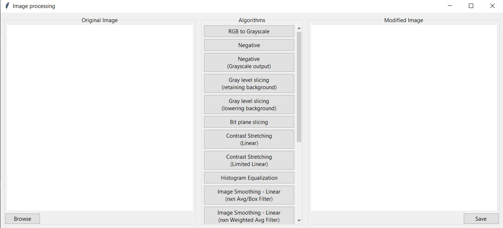

# Image processing GUI

GUI created using Tkinter in python.

## Available Algorithms:

-   RGB to grayscale
-   Negative
-   Gray level slicing
    -   Lowering background
    -   Retaining background
-   Bit plane slicing
-   Contrast stretching
    -   Linear
    -   Limited Linear
-   Histogram equilization
-   Image smoothing
    -   Linear
        -   Average/Box filter
        -   Weighted Average filter
    -   Non Linear
        -   Median filter
        -   Weighted Median filter
-   Image sharpening
    -   Gradient operator
        -   Roberts operator
        -   Prewitt operator
        -   Sobel operator
    -   Laplacian operator
-   Canny edge detection
